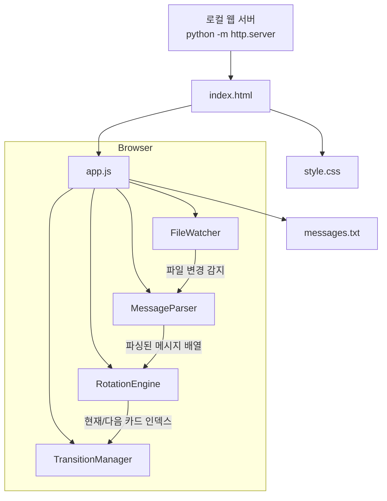

# Design Document: AIOps Typography Rotation

## Overview

AWS Summit 데모 부스용 타이포그래피 로테이션 디스플레이 애플리케이션의 기술 설계 문서이다. 이 애플리케이션은 순수 HTML, CSS, JavaScript로 구성되며, 빌드 도구 없이 로컬 웹 서버에서 바로 실행 가능한 단일 페이지 애플리케이션(SPA)이다.

핵심 설계 원칙:
- **단순성**: 빌드 과정 없이 정적 파일만으로 동작
- **안정성**: 8시간+ 연속 실행을 위한 메모리 관리
- **유연성**: 텍스트 파일 수정만으로 문구 변경 가능
- **시각적 완성도**: AWS 브랜드 컬러와 타이포그래피 기반 디자인

## Architecture

### 시스템 구조



### 파일 구조

```
project/
├── index.html          # 메인 HTML (풀스크린 레이아웃)
├── style.css           # 스타일시트 (타이포그래피, 애니메이션, 반응형)
├── app.js              # 애플리케이션 로직 (파싱, 로테이션, 전환, 감시)
├── messages.txt        # 홍보 문구 데이터 파일
└── serve.sh            # 로컬 서버 실행 스크립트 (한 줄 명령어)
```

### 설계 결정 사항

| 결정 | 선택 | 근거 |
|------|------|------|
| 파일 변경 감지 방식 | Polling (fetch + Last-Modified 헤더) | FileSystem API는 브라우저 지원 제한, 오프라인 환경에서 안정적 |
| 전환 애니메이션 | CSS opacity transition + JS 클래스 토글 | GPU 가속, 메모리 효율적, 깜빡임 방지 |
| 타이머 관리 | setTimeout 체인 (setInterval 대신) | 전환 애니메이션 완료 후 정확한 타이밍 보장 |
| 폰트 로딩 | 시스템 산세리프 폰트 스택 | 오프라인 동작 보장, 추가 리소스 불필요 |
| 메시지 파싱 | 빈 줄 구분자 기반 텍스트 파싱 | 비개발자도 쉽게 편집 가능 |

## Components and Interfaces

### 1. MessageParser

텍스트 파일 내용을 구조화된 메시지 배열로 변환하는 순수 함수 모듈.

```typescript
// 인터페이스 정의 (실제 구현은 JavaScript)
interface Message {
  main: string;    // 메인 텍스트 (첫 번째 줄)
  sub: string;     // 서브 텍스트 (두 번째 줄, 없으면 빈 문자열)
}

// 핵심 함수
function parseMessages(rawText: string): Message[]
```

**책임:**
- 원시 텍스트를 빈 줄 기준으로 분리
- 각 블록에서 첫 줄을 main, 두 번째 줄을 sub로 추출
- 빈 블록 필터링
- 파싱 실패 시 빈 배열 반환

### 2. RotationEngine

메시지 순환 상태를 관리하고 타이밍을 제어하는 모듈.

```typescript
interface RotationState {
  messages: Message[];
  currentIndex: number;
  intervalMs: number;       // 기본 8000ms
  isRunning: boolean;
  timerId: number | null;
}

// 핵심 함수
function nextIndex(currentIndex: number, totalMessages: number): number
function start(state: RotationState): void
function stop(state: RotationState): void
function updateMessages(state: RotationState, newMessages: Message[]): void
```

**책임:**
- 현재 인덱스 관리 및 순환 (마지막 → 첫 번째)
- 타이머 시작/정지
- 메시지 업데이트 시 인덱스 유효성 보장
- 메시지가 비어있을 때 안전한 처리

### 3. TransitionManager

CSS 기반 페이드인/아웃 전환을 제어하는 모듈.

```typescript
interface TransitionConfig {
  fadeOutDuration: number;  // ms, 기본 500
  fadeInDuration: number;   // ms, 기본 500
}

// 핵심 함수
function transitionTo(
  container: HTMLElement,
  message: Message,
  colorIndex: number,
  config: TransitionConfig
): Promise<void>
```

**책임:**
- 현재 카드 페이드아웃 → 콘텐츠 교체 → 새 카드 페이드인
- 전환 중 빈 화면 방지 (이중 버퍼링 또는 opacity 전환)
- 카드별 색상/그라데이션 변화 적용
- 전환 완료 시 Promise resolve

### 4. FileWatcher

messages.txt 파일의 변경을 주기적으로 감지하는 모듈.

```typescript
interface WatcherConfig {
  url: string;              // messages.txt 경로
  pollIntervalMs: number;   // 기본 3000ms
}

// 핵심 함수
function startWatching(config: WatcherConfig, onUpdate: (text: string) => void): void
function stopWatching(): void
```

**책임:**
- 주기적 fetch 요청으로 파일 변경 감지 (Last-Modified 또는 내용 비교)
- 변경 감지 시 콜백 호출
- 네트워크 오류 시 조용히 무시 (기존 메시지 유지)
- 메모리 누수 방지를 위한 정리 함수 제공

### 5. StyleManager

카드별 시각적 다양성을 제공하는 스타일 관리 모듈.

```typescript
interface CardStyle {
  background: string;       // 배경 그라데이션 CSS 값
  accentColor: string;      // 강조 색상
}

// 핵심 함수
function getCardStyle(index: number, totalCards: number): CardStyle
```

**책임:**
- 카드 인덱스에 따른 배경 그라데이션 생성
- AWS 브랜드 컬러 기반 색상 팔레트 순환
- 어두운 배경 + 밝은 텍스트 고대비 유지

## Data Models

### Message 구조

```javascript
// messages.txt 파일 형식
// 각 메시지는 빈 줄로 구분
// 첫 번째 줄: 메인 텍스트
// 두 번째 줄: 서브 텍스트 (선택)

/*
예시:
AI가 장애를 예측합니다
사후 대응에서 사전 예방으로

운영 비용을 40% 절감
지능형 리소스 최적화

24/7 자동 모니터링
사람이 놓치는 이상 징후를 AI가 감지
*/
```

### 내부 데이터 모델

```javascript
// 파싱된 메시지
const message = {
  main: "AI가 장애를 예측합니다",
  sub: "사후 대응에서 사전 예방으로"
};

// 로테이션 상태
const rotationState = {
  messages: [],           // Message[]
  currentIndex: 0,        // 현재 표시 중인 메시지 인덱스
  intervalMs: 8000,       // 표시 간격 (ms)
  isRunning: false,       // 로테이션 실행 중 여부
  timerId: null           // setTimeout ID
};

// 카드 스타일 팔레트
const CARD_STYLES = [
  { background: "linear-gradient(135deg, #232F3E 0%, #1a2332 100%)", accent: "#FF9900" },
  { background: "linear-gradient(135deg, #1a2332 0%, #0d1117 100%)", accent: "#FF9900" },
  { background: "linear-gradient(135deg, #232F3E 0%, #2d1b00 100%)", accent: "#FFFFFF" },
  // ... 카드 수에 맞게 순환
];

// 기본 폴백 메시지
const DEFAULT_MESSAGES = [
  { main: "AI가 장애를 예측합니다", sub: "사후 대응에서 사전 예방으로" },
  { main: "운영 비용을 40% 절감", sub: "지능형 리소스 최적화" },
  { main: "24/7 자동 모니터링", sub: "사람이 놓치는 이상 징후를 AI가 감지" },
  { main: "평균 복구 시간 80% 단축", sub: "자동화된 인시던트 대응" },
  { main: "클라우드 운영의 미래", sub: "AIOps로 시작하세요" }
];
```

### 파일 감시 상태

```javascript
const watcherState = {
  lastContent: "",          // 마지막으로 읽은 파일 내용 (변경 비교용)
  pollTimerId: null,        // polling 타이머 ID
  pollIntervalMs: 3000,     // 감시 주기
  isWatching: false
};
```


## Correctness Properties

*A property is a characteristic or behavior that should hold true across all valid executions of a system—essentially, a formal statement about what the system should do. Properties serve as the bridge between human-readable specifications and machine-verifiable correctness guarantees.*

### Property 1: 순환 인덱스 (Cyclic Index)

*For any* 양의 정수 totalMessages와 0 이상 totalMessages 미만의 currentIndex에 대해, nextIndex(currentIndex, totalMessages)는 항상 (currentIndex + 1) % totalMessages를 반환해야 한다.

**Validates: Requirements 2.1, 2.3**

### Property 2: 메시지 파싱 라운드트립 (Message Parsing Round-Trip)

*For any* 유효한 Message 배열(각 메시지는 비어있지 않은 main 텍스트와 임의의 sub 텍스트를 가짐)에 대해, 해당 배열을 messages.txt 형식으로 직렬화한 후 parseMessages로 파싱하면 원래 배열과 동일한 결과를 반환해야 한다.

**Validates: Requirements 4.2, 4.3**

### Property 3: 로드 실패 시 폴백 보장 (Fallback on Load Failure)

*For any* 오류 상황(네트워크 오류, 빈 응답, 잘못된 형식)에서 메시지 로딩을 시도할 때, 시스템은 항상 비어있지 않은 기본 Message_Set을 반환하여 로테이션이 중단되지 않아야 한다.

**Validates: Requirements 4.6**

### Property 4: 카드 스타일 다양성 (Card Style Diversity)

*For any* totalCards >= 2인 카드 세트에서, 연속된 두 인덱스 i와 (i+1) % totalCards에 대해 getCardStyle(i, totalCards)와 getCardStyle((i+1) % totalCards, totalCards)는 서로 다른 배경 스타일을 반환해야 한다.

**Validates: Requirements 5.3**

## Error Handling

### 에러 처리 전략

| 에러 상황 | 처리 방식 | 사용자 영향 |
|-----------|-----------|-------------|
| messages.txt 로드 실패 | 기본 메시지 세트로 폴백 | 없음 (기본 문구 표시) |
| messages.txt 파싱 실패 (빈 파일) | 기본 메시지 세트로 폴백 | 없음 |
| JavaScript 런타임 오류 | window.onerror로 캐치, 로테이션 재시작 | 순간적 전환 지연 가능 |
| 파일 감시 fetch 실패 | 조용히 무시, 다음 polling 주기에 재시도 | 없음 (기존 메시지 유지) |
| 메시지 업데이트 시 인덱스 초과 | currentIndex를 0으로 리셋 | 첫 번째 카드부터 재시작 |

### 글로벌 에러 핸들러

```javascript
// 모든 미처리 에러를 캐치하여 로테이션 중단 방지
window.onerror = function(msg, url, lineNo, columnNo, error) {
  console.warn('Error caught:', msg);
  // 로테이션이 멈춘 경우 재시작
  if (!rotationState.isRunning) {
    start(rotationState);
  }
  return true; // 에러 전파 방지
};

window.addEventListener('unhandledrejection', function(event) {
  console.warn('Unhandled rejection:', event.reason);
  event.preventDefault();
});
```

### 메모리 누수 방지

- **타이머 관리**: 새 타이머 설정 전 기존 타이머 항상 clearTimeout
- **이벤트 리스너**: 등록된 리스너 추적 및 필요 시 제거
- **DOM 참조**: 전환 시 이전 카드 DOM 노드 재사용 (생성/삭제 반복 금지)
- **문자열 참조**: 파일 감시 시 이전 내용 참조를 새 내용으로 교체

## Testing Strategy

### 테스트 프레임워크

- **단위 테스트**: Jest (순수 함수 테스트)
- **속성 기반 테스트**: fast-check (JavaScript PBT 라이브러리)
- **테스트 실행**: `npx jest --run` (watch 모드 없이 단일 실행)

> 참고: 테스트는 개발/검증 목적으로만 사용되며, 프로덕션 배포에는 포함되지 않는다. 프로덕션 파일(index.html, style.css, app.js, messages.txt)은 빌드 없이 동작한다.

### 속성 기반 테스트 (Property-Based Tests)

각 Correctness Property에 대해 fast-check를 사용한 PBT를 구현한다.

| Property | 테스트 대상 함수 | 생성기 |
|----------|-----------------|--------|
| Property 1: 순환 인덱스 | `nextIndex(current, total)` | `fc.nat()` for index, `fc.integer({min:1, max:1000})` for total |
| Property 2: 파싱 라운드트립 | `parseMessages(serialize(messages))` | `fc.array(fc.record({main: fc.string(), sub: fc.string()}))` |
| Property 3: 폴백 보장 | `loadMessages(failingFetch)` | `fc.oneof(fc.constant('network-error'), fc.constant('404'), ...)` |
| Property 4: 스타일 다양성 | `getCardStyle(i, total)` | `fc.nat()` for index, `fc.integer({min:2, max:20})` for total |

**설정:**
- 최소 100회 반복 실행
- 각 테스트에 태그 주석: `// Feature: aiops-typography-rotation, Property N: ...`

### 단위 테스트 (Example-Based Tests)

| 테스트 대상 | 검증 내용 |
|------------|-----------|
| MessageParser - 기본 파싱 | 2개 메시지가 있는 텍스트 파싱 결과 확인 |
| MessageParser - sub 없는 메시지 | main만 있는 블록 파싱 시 sub가 빈 문자열 |
| MessageParser - 빈 입력 | 빈 문자열 파싱 시 빈 배열 반환 |
| RotationEngine - 시작/정지 | start() 후 isRunning === true, stop() 후 false |
| RotationEngine - 메시지 업데이트 | 더 짧은 배열로 업데이트 시 인덱스 리셋 |
| TransitionConfig - 기본값 | fadeOut + fadeIn <= 1000ms |
| FileWatcher - 변경 감지 | 내용 변경 시 콜백 호출 확인 |
| FileWatcher - 동일 내용 | 내용 미변경 시 콜백 미호출 확인 |
| 기본 messages.txt | 5개 이상 메시지 포함 확인 |
| 에러 핸들러 | onerror 후 로테이션 재시작 확인 |

### 테스트 실행 방법

```bash
# 테스트 의존성 설치 (개발 시에만)
npm init -y
npm install --save-dev jest @fast-check/jest fast-check

# 테스트 실행
npx jest --run
```
